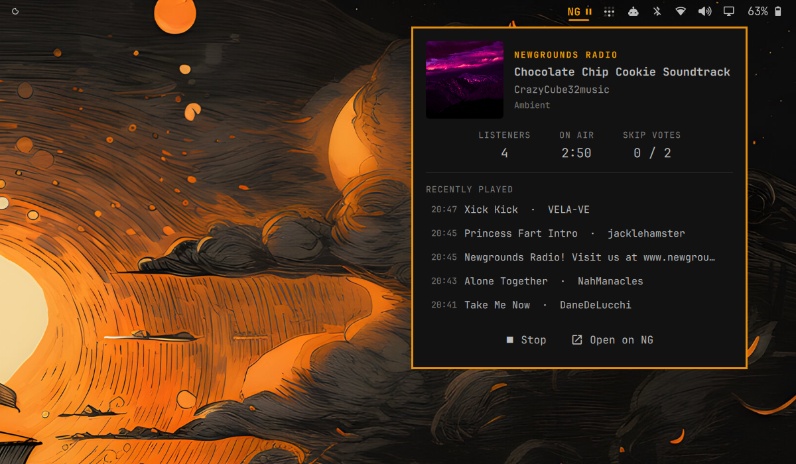

# Newgrounds Radio for Omarchy

Listen to [Newgrounds Radio](https://www.newgroundsradio.com) straight from the
[Omarchy](https://omarchy.org) bar — realtime now-playing info, album art,
listener stats, and a play history, with no polling.

The official Newgrounds Radio client for Omarchy, from the team that runs the
station.



- Compact orange **NG** + play/pause pill in the bar
- Popup panel with album art, track / artist / genre, live listener count,
  on-air time, and skip votes
- Recently-played list — each track row links to the track on Newgrounds
- Album art and title link to the track page; the artist links to their
  Newgrounds user page (when the artist is a single username)
- Desktop notification on track change while you're listening
- Realtime updates over the station's socket.io feed (a tiny Engine.IO v4
  client over WebSockets — no REST polling), with automatic reconnect
- One shared mpv stream and one socket connection, no matter how many
  monitors your bar spans

## Install

Requires `mpv` (included with Omarchy) and `qt6-websockets`:

```bash
omarchy pkg add qt6-websockets
omarchy plugin add https://github.com/brenc/omarchy-newgrounds-radio.git --enable
```

Then add the **Newgrounds Radio** widget to your bar from `omarchy-shell` bar
settings, or run `omarchy restart shell` if it does not appear.

## Uninstall

```bash
omarchy plugin remove brenc.newgrounds-radio
```

That removes the plugin and its bar widget. The plugin never writes outside its
own entry in `~/.config/omarchy/shell.json`; if you added an optional
`trackNotifications` override there (see [Usage](#usage)), remove that entry by
hand. `qt6-websockets` is left installed — remove it with
`omarchy pkg drop qt6-websockets` if nothing else needs it.

## Usage

| Where | Click | Action |
|---|---|---|
| Bar pill | Left | Play / stop the stream |
| Bar pill | Right | Open the now-playing popup |
| Popup: album art or title | Left | Open the track on Newgrounds |
| Popup: artist | Left | Open the artist's Newgrounds page |
| Popup: NEWGROUNDS RADIO | Left | Open newgroundsradio.com |
| Popup: history row | Left | Open that track on Newgrounds |

Track-change notifications only fire while the stream is playing. To turn
them off, add `"trackNotifications": false` to the widget's entry in
`~/.config/omarchy/shell.json`:

```json
{ "id": "brenc.newgrounds-radio", "trackNotifications": false }
```

## How it works

- `Service.qml` (a singleton shell service) owns the mpv process for
  <https://stream.newgroundsradio.com/radio.mp3> and a WebSocket connection to
  the station's socket.io endpoint, which pushes a full status — current
  track, listeners, skip votes, play log — on connect and on every change.
  Playback auto-reconnects if the stream drops; the socket reconnects with a
  watchdog for silent connection deaths (suspend/resume, network drops).
- `BarWidget.qml` renders the bar pill and popup on each monitor, all reading
  the one shared service.

The stream is already loudness-normalized by the station, so the plugin plays
it as-is.

## Troubleshooting

If the widget doesn't appear in the bar at all, the most likely cause is a
missing `qt6-websockets` — install it and run `omarchy restart shell`.

## License

This plugin is [MIT](LICENSE) licensed.

### External dependencies

Nothing is vendored or bundled — the plugin only invokes software you install
separately, and streams from Newgrounds' own servers:

| Dependency | Role | License |
|---|---|---|
| [`mpv`](https://mpv.io) (ships with Omarchy) | Plays the audio stream | GPL-2.0-or-later / LGPL-2.1-or-later |
| [`qt6-websockets`](https://doc.qt.io/qt-6/qtwebsockets-index.html) | QML WebSocket type for the realtime feed | LGPL-3.0 / GPL-3.0 (Qt open-source terms) |
| [Quickshell](https://quickshell.org) (via Omarchy) | Shell/QML runtime hosting the widget | LGPL-3.0 |

Audio, artwork, and track metadata are served by
[Newgrounds Radio](https://www.newgroundsradio.com) and remain the property of
Newgrounds and the respective artists.
